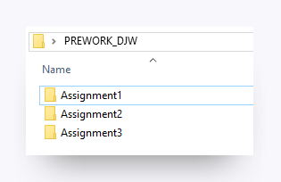
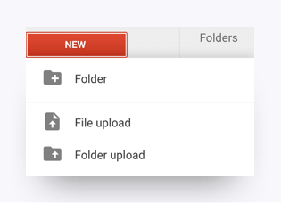
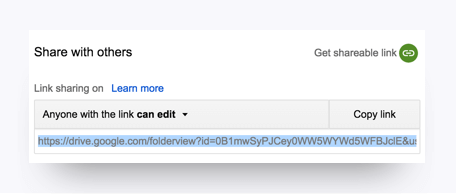

# Module 1: Get Started

You have already made big strides toward your desired career in cybersecurity. Your first step was signing up for the boot camp. The second step will be completing this prework. 

The boot camp will present many challenges. This prework, which contains 8 different modules, is designed to provide the information and guidance you need to succeed in the first few weeks of the course. We recommend reading the modules in order, but you can complete the activities and assignments in any order you choose. 

The time and effort required to complete this prework will give you a taste of the challenges to come. Just remember that perfection isn't everything. Give each of these modules your all and submit whatever you create. You'll have the rest of the course to smooth out the edges.

Good luck!

---

## Use the Right Tools for the Job

Being successful in this course begins with the right equipment. Below are the equipment requirements for this course. **Note:** If you are unable to meet these requirements, please contact your Student Success Manager.

* Laptop with at least 8 GB RAM and 64-bit dual processor

  **Note:** Desktops, netbooks, thin clients, and tablets are not permitted.

* 100 GB free disk space \(300 GB preferred\)

* At least 2.0 GHz CPU

* Virtualization capable \(Check BIOS settings.\)

* USB port

* Full administrator \("root"\) privileges to operating and all software

---

## How to Submit Prework Assignments

You will submit your completed assignments on [Bootcamp Spot](https://www.bootcampspot.com/login), which you'll be given access to after you enroll in the course. Follow these steps to submit your assignments. 

1. Create a local folder on your computer titled PREWORK\_{INITIALS}, e.g., PREWORK\_AFH. 

2. Create a subfolder for each module so that your folder looks something like this:  

3. When you complete an assignment, save your solution in the appropriate subfolder. In some cases, you may need to copy multiple files into the subfolder.

4. Create a [Google Drive](https://www.google.com/drive/) account if you don't already have one.

5. Select **New > Folder upload** to upload your local folder to Google Drive. **Note:** This can be done after you have completed all prework assignments. 

6. Right-click the folder and change the sharing settings to **Anyone with the link can edit.** 

7. Copy the folder link. 

8. Log in to Bootcamp Spot and find the prework assignment associated with your class.

9. Click on the assignment and paste the Google Drive link. 

And that's it! You're ready for Module 2! 

## Supplemental Resources

- ##### [Sharing Files Using Google Drive](sharing-files-using-google-drive.md) 