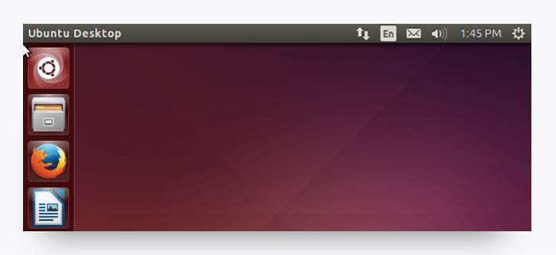

# Module 2: Install Your Tools (Required)

This course will expose you to a wide range of tools, many of which may be unfamiliar to you. Although they may be overwhelming at first, these tools will soon become as familiar to you as a scalpel is to a surgeon. The purpose of this section is to acquaint you with each of these tools before walking you through the process of installing them on your machine.

Below is a list of the tools you should install before your first class to ensure you're ready to dive in on Day 1. 

* Google Chrome

- Slack
- Git Bash \(Windows only)
- Terminal \(Mac only; pre-installed\)
- Python (Version 3)
- SSH keys
- VirtualBox
- Ubuntu Linux
- Kali Linux
- GitKraken
- Wireshark
- Cisco Packet Tracer

You should also create accounts on the following websites: 

* LinkedIn
* GitHub
* GitLab
* Google
* Cisco
* SANS
* ISACA
* (ISC)^2^

If you encounter any issues during setup, don't worry. Your instructional staff will help you troubleshoot any errors and answer your questions on the first day of class. Just sit tight until then. 

## An Overview of Your Tools

Before installing your tools, take a moment to examine the main ones in more detail to better understand the role they will play in the course. 

### Google Chrome

This is the web browser we'll be using to quickly determine whether our code is working. Google Chrome has a number of tools that make it an ideal platform for our purposes, so if you are currently using a different browser, we encourage you to switch to Chrome. 

### Slack

Slack is an online communication tool that is a mix of forum, instant messenger, and email all rolled into one. It's a tool used by countless organizations worldwide, and you'll be using it every single day for the next six months. 

We will use Slack to send code snippets during class, relay important announcements, and facilitate group exercises. You will receive the link to your class-specific channel during orientation. Though there is a Slack web client, for this course you should have the program installed on your machine. 

### Git Bash and Terminal

Git Bash (for Windows users) and Terminal (for Mac users) offer a command-line interface for working with the files and folders on your computer.

*So, is it like Finder or Windows Explorer?* Kind of, except that there are no pictures or visuals. It's just a box with text. 

*Uh, why would I want that?* Over time, you'll come to understand that, in many situations, using a command-line interface can be faster and more effective than relying on the operating system's graphical user interface (GUI). You'll get plenty of exposure to the command line at the beginning of the course. 

### Git, GitHub, and GitLab

A term you will come to know well over the next few months is Git. Coders depend on Git for version control—the process of logging the development of programs and applications. This comes in handy during collaborative programming, when teams of programmers change, add, and remove code throughout a project’s directory. Without Git, this process would be chaotic.

GitHub allows programmers to manage, track, and store their collaborative actions online. In a way, GitHub serves as a sort of Dropbox for coders. It offers a central place for individuals and teams to upload their code, view revision history, and make changes to a master set of files. 

GitLab is a similar platform to GitHub. We will be using GitLab to store and retrieve course files. A separate account is not needed to access GitLab; you can use your GitHub credentials. 

You'll come to learn a lot about Git, GitHub, and GitLab in your first week of class. You will receive the link to your class-specific repository during orientation.

### SS Keys

Generating SSH Keys allows developers to interface with certain remote services without having to constantly type in their  login information. You're going to set up an SSH key for GitHub. Without a key, you won’t be able to push your code to GitHub without entering a password each time. And trust us, that would be as irritating as needing a key to open every door in your home.

### Python (Version 3) 

You'll be doing a little bit of coding in this class using Python. We don't expect you to become a programmer, but you will learn how to recognize and understand code syntax, which will give you a strong advantage when it comes to cybersecurity. 

### VS Code

We use text editors to create and write our code files. For this class, we'll be using VS Code as our initial text editor. 

### VirtualBox

Throughout the course we will be doing many hands-on labs, which have different requirements in terms of software and platform. To ensure both Windows and Mac users can complete the same tasks, we will VirtualBox. The primary benefit of this free software is the ability to run multiple operating systems simultaneously. This will allow you to run Mac and Linux programs on Windows (and vice versa) without the need of a separate machine or having to reboot your device. 

### Kali Linux

Kali Linux is one of many available distributions of the Linux operating system. Not only is Kali a great learning platform, it is also specifically designed for security specialists and has dozens of hacking tools preinstalled. Due to Kali's popularity, there are many free tutorials and guides available in addition to paid options. 

### Ubuntu Linux

In the course we will be using Linux for several classes. Linux is an alternative to operating systems like Windows and Mac. You may have never used Linux before, and that's fine. The first version we will be using has a friendly graphical user interface \(GUI\). At first, Linux may seem very similar to the Mac operating system but without some familiar programs. Ubuntu is a complete Linux operating system that is freely available. 

### GitKraken

GitKraken is tool that is going to make life a lot easier working with GitHub and GitLab. GitKraken is the sleek graphical user interface \(GUI\) that makes uploading and downloading files simpler. Traditionally, code writers interact with these sites via commands; but since you will use the sites for different purposes, we'll keep it simple.

### Wireshark

Wireshark is a network packet analyzer. A network packet analyzer tries to capture network packets and display that packet data in as detailed a way as possible.

You can think of a network packet analyzer as a measuring device used to examine what’s going on inside a network cable, just like a voltmeter is used by an electrician to examine what’s going on inside an electric cable. 

In the past, such tools were either very expensive, proprietary, or both. However, with the advent of Wireshark, all of that has changed.

## You're Ready to Install! 

Now it's time to collect your tools and begin. Setup guides for both Mac and Windows users are provided in the links below. Follow the instructions closely and do your best with the information you have. \(Yes, we know there is a lot to install.) 

One bit of advice: Throughout the course, you will frequently need to install and use unfamiliar tools. Resist the urge to stop and ask, "Am I doing this right?" Instead, trust your instincts and take your best stab at it. If you get lost, we'll get you the help you need right away. You can do this! 

* ##### [Get Your Tools Installed \(Mac\)](get-yo-tools-installed-mac.md)
* ##### [Get Your Tools Installed \(Windows\)](get-yo-tools-installed-windows.md)
