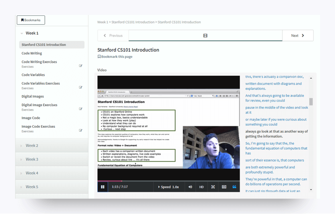
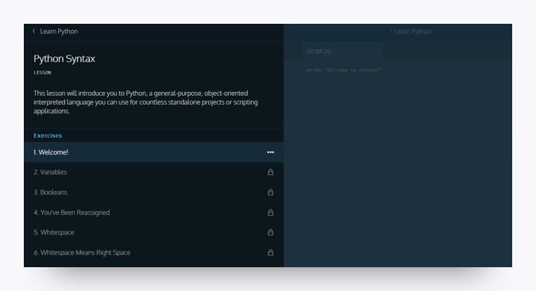
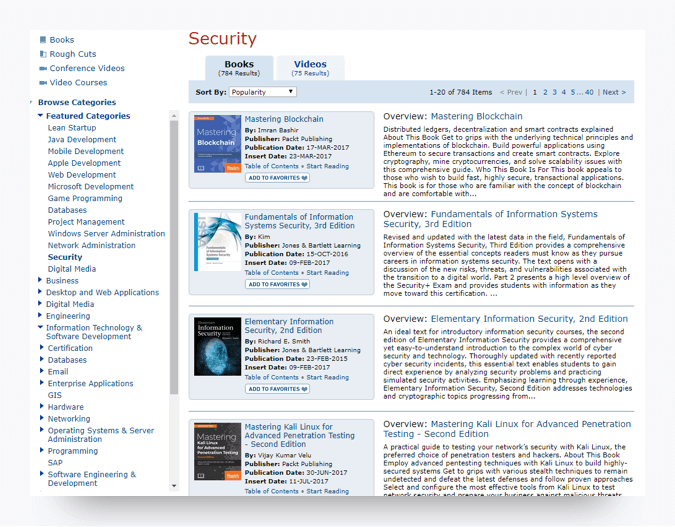

# Module 3: Recommended Activities and Resources

Now that you have all the tools, you'll be able to hit the ground running on the first day of class. You may be curious about what the first few weeks of class will cover and if there is anything you can do to get ready beforehand. 

We will cover a lot of ground at the begining of course. Everything from largre-scale overviews of the cybersecurity domains and job markets to hands-on skills like working in the terminal and coding with python to fundamental concepts like networking and operating systems. Maybe that sounds daunting to you. Maybe you're familiar with a few of those skills, but you could use a refresher... Either way, have no fear! You will have plenty of opportunities to learn and practice once class starts. But you can also start right now, with some introductory prep activities.

## Recommended Courses

Below is a list of recommended courses, readings, and writing activities focused on developing your skills as a cybersecurity professional.  We strongly encourage you to complete them at some point during the course. 

### SANS Cyber Aces

[SANS Cyber Aces](http://www.cyberaces.org/) is an online course that teaches the core concepts related to operating systems, networking, and systems administration. The course was developed by SANS and is *free*. The course is self-paced through video lectures.

1. A few things to be aware of: 
   - There are several hours of material in the videos. To help you choose which material to prioritize, our top three recommended lessons are: 
     - [Linux—OS Background & Building the Linux VM](https://tutorials.cyberaces.org/tutorials/view/1-1-2)
     - [Networking—Introduction and Layer 1](https://tutorials.cyberaces.org/tutorials/view/2-1)
     - [Windows—Command Line Basics](https://tutorials.cyberaces.org/tutorials/view/1-2-3)
   - These courses are designed with the assumption that viewers will have solid IT fundamentals.  
   - Watching these videos will put you ahead of the game! You can see the full library [here](https://tutorials.cyberaces.org/tutorials). 

### Codecademy: Python Tutorial

We will cover coding in this cybersecurity course. If you don't have coding experience or could use a refresher, check out [Codecademy](https://www.codecademy.com/), particularly the tutorial on [Python](https://www.codecademy.com/learn/learn-python). Python is a programming language that is often used due to its versatility and overall user-friendliness. 

The Python tutorial will get you acquainted with coding and set you up for the material coming down the pipeline in this course. Note that you must create a Codeacademy account before you can sign up for one of their courses. 

### Stanford Computer Science 101

If you do not have a technology background, you're in luck! Stanford University's School of Engineering offers Computer Science 101 (CS101) as a [free online course](https://online.stanford.edu/courses/soe-ycscs101-sp-computer-science-101) geared toward those with no prior experience in the tech field. CS101 aims to provide general background on computers, demystify how they operate, and make them more accessible to a novice audience. 

To enroll in the course, you will need to register for a Stanford Online account as well as agree to Stanford University's academic policies and code of conduct. 

The entire course can be completed in about four hours and includes exercises.  

## Recommended Writing

Newcomers to the cybersecurity field are often surprised by the amount of writing they are required to do, specifically report writing. If you are a good writer or simply enjoy writing, your future employer is going to love you. But if your writing skills could use some work, fear not! There are many resources available to help you, including the video series [Professional Writing Skills](https://www.youtube.com/playlist?list=PLzLHunnjEdX-YLYtSFgTfVJovtc8I4prp).

We'll be doing plenty of writing in this program, including a report that you can later use as a writing sample for employers. You should use Google Docs for writing assignments. 

## Recommended Reading: Safari Books

In addition to the texts listed in Module 4, we recommend [Safari Books](https://www.safaribooksonline.com/) for cybersecurity articles and information. Safari Books is an amazing resource for technical books and video tutorials (there are thousands of each\). It comes with the price tag of 400 dollars per year or 39 per month. It is well worth the investment if it is financially feasible for you. All of the texts recommended in Module 4 are available on this platform. This resource is one that can help you every day on the job to help you internalize a new topic or skill. 

**Note:** Veterans and current military may be eligible to obtain free access. Contact the learning resource center of your unit or base for more information. 

-------

### Copyright

Trilogy Education Services © 2018. All Rights Reserved.

