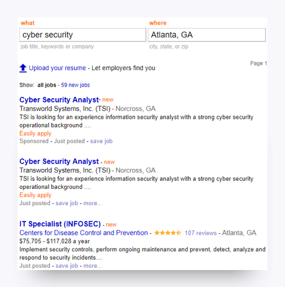
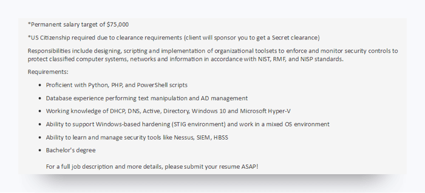

# Module 4: Understand the Job Market

In this section, you will get acquainted with the cybersecurity job market by using Indeed.com. We will also provide a list of professional resources. 

## Activity: Explore Indeed.com

### Overview

A crucial step in the job search is familarizing yourself with the types of jobs currently in demand in the field. The following activity is designed to help you do this using the job board [Indeed.com](https://www.indeed.com/). 

### Instructions

1. Enter **cyber security** (two words) in the **what** field. Set your location in the **where** field. Hit **return** or **Enter** (depending on your keyboard) to initiate the search. 

   Note: If you do not live in a metropolitan area, we recommend increasing the search radius in the left menu. 

2. Repeat the search with the following terms in the **what** box: 

   - cybersecurity (one word)
   - cyber
   - IT security
   - information 
   - INFOSEC
   - information assurance

3. Complete the following tasks:

   - Find a job post that interests you. Copy and paste the job description into a document and save it to a local folder.
   - Identify 10 terms that recur across multiple posts. Research each term, and then define it in your own words (one to three sentences per term). 

### Notes

- Job titles for security professionals vary from organization to organization. Pay attention to the variety of job titles and adjust your search criteria as necessary so that you don't miss out on job postings.

- You may notice titles like *analyst, engineer, architect,* and *specialist.* We will discuss the hierarchy of these roles in class.

## Resources

Check out the following infographics and articles to find out who is hiring and what they're looking for in candidates. 

- [State of Cyber Security 2017: Workforce Trends and Challenges](https://www.isaca.org/cyber/Documents/State-of-Cybersecurity-infographic_res_eng_0217.pdf)
- [State of Cyber Security 2017: Resources and Threats](http://www.isaca.org/cyber/Documents/State-of-Cybersecurity-part-2-infographic_res_eng_0517.pdf)
- [State of Cyber Security 2017: Part 2: Current Trends in the Threat Landscape](http://www.isaca.org/Knowledge-Center/Research/Documents/state-of-cybersecurity-2017-part-2_res_eng_0517.PDF)
- [The State of Cyber Security: 2016](http://www.isaca.org/cyber/Documents/State-of-Cybersecuritynew-infographic.pdf)
- [State of Cybersecurity: Implications for 2016](http://www.isaca.org/cyber/Documents/state-of-cybersecurity_res_eng_0316.pdf)
- [How to Get a Cybersecurity Job in Three Charts: a Degree, a Certification, and a Clearance](http://burning-glass.com/how-to-get-a-cybersecurity-job-in-three-charts-a-degree-a-certification-and-a-clearance/)
- [Cybersecurity Supply/Demand Heat Map](http://cyberseek.org/heatmap.html)

