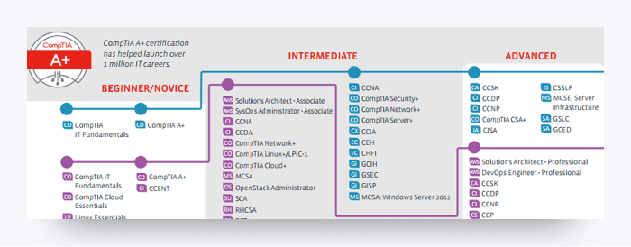

# Module 5: Certification Roadmap

This activity is designed to introduce you to the world of information technology certifications.  A certification is a testament to your skills and proficiency in a certain subject area or technology. Holding certifications has been shown to increase a job seeker's marketability to employers as well as result in a higher salary when hired. Certifications can also help you further your professional development. There are a variety of certifications available. Obtaining a certification almost always involves passing an exam.

To explore various certification pathways and general landscape, we will be using a resource developed by CompTIA, a certification body and professional organization. Here's what you need to do: 

1. Go to the [IT Certification Roadmap](https://certification.comptia.org/docs/default-source/downloadablefiles/it-certification-roadmap.pdf). 
2. Review the diagram, making note of CompTIA Network+, CompTIA Security+, CEH, and CISSP. These are the certifications that this cybersecurity boot camp was developed around. (This boot camp was influenced by other certifications in this diagram as well.) 

3. Download and save the following files to your computer. These will allow you to explore key certifications in depth to familiarize yourself with the content that lies ahead. They also serve as useful guides for the certification exams. You will notice that these certifications overlap significantly.
   - [Network+](https://certification.comptia.org/docs/default-source/exam-objectives/comptia-network-%28n10-006%29_examobjectives.pdf)
   - [Security+](https://certification.comptia.org/docs/default-source/exam-objectives/comptia-security-sy0-501-exam-objectives.pdf?sfvrsn=2)
   - [Ethical Hacking \(CEH\)](https://www.eccouncil.org/wp-content/uploads/2016/02/cehv9-brochure.pdf)
   - [Cybersecurity Leadership \(CISSP\)](https://www.isc2.org/-/media/ISC2/Certifications/Exam-Outlines/CISSP-Exam-Outline-121417--Final.ashx)

4. For each document, do the following: 
   - Review the exam objectives you downloaded.
   - In a Google Doc, make a list of topics with which you are already familiar, and save it in Google Drive.
   - Submit this list using the instructions found in Module 1. 
