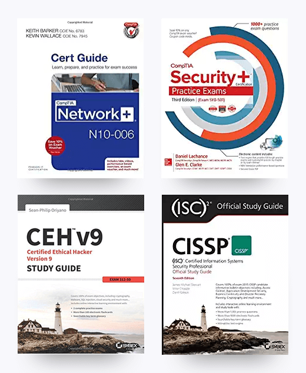

# Module 6: Companion Textbooks

We highly recommend the following cybersecurity books, which may be available in digital formats as well as print. You may elect to purchase these after the course start date.

1. *CompTIA® Network+ N10–006 Cert Guide* by Keith Barker and Kevin Wallace
2. *CompTIA Security+ Certification Study Guide, Third Edition \(Exam SY0-501\)* by Glen E. Clarke
3. *CEH v9* B by Sean-Philip Oriyano
4. *CISSP \(ISC\)2 Certified Information Systems Security Professional Official Study Guide, Seventh Edition* by James M. Stewart, Mike Chapple, and Darril Gibson

#### 
