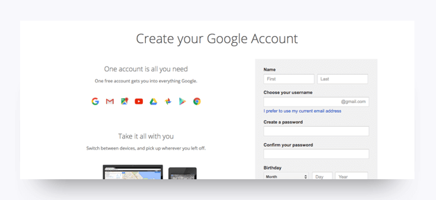

# Sharing Files Using Google Drive

## Google Chrome

During this course, consider Chrome _the_ web browser; it comes loaded with tools that will help you in this course.

1. If you don’t already have Chrome installed, visit the download page [here](https://www.google.com/chrome/browser/desktop/index.html).

2. Download, open, and run the installation file.

## Google Drive

After you have downloaded Chrome you should go ahead and create a Google account. There are many useful apps that come with this account, one of which is Google Drive, which you will be using often in this course. Follow the instructions below to create a Google account, and then learn about how to upload and share contents of your Google Drive.

1. Go to Google's [sign-up page](https://accounts.google.com/SignUp?).

2. Fill out the required information, and then click **Next**. 

3. Review Google's Privacy Policy and accept the terms to proceed. You will be routed to Google's Welcome page. 

4. Click **Continue** to go to the Google homepage. 

5. Click the grid icon located in the top right-hand corner of the Chrome browser window to access your Google apps. 

6. Click the Drive icon from the drop-down menu. 

In Google Drive you can create and upload folders and files and share these files with others. Sharing content is as easy is providing someone with a link. For example, to upload and share a specific folder with your instructor, just follow these instructions:

1. In Drive, click **New** and **Folder upload**.

2. Select the folder you want to upload and click **Upload**. A copy of the folder will now be inside of your Google Drive.

3. Right-click on the folder in Google Drive and select **Get shareable link** from the drop-down menu.

4. Open the sharing settings and choose **Anyone with the link can edit**. 

5. Click **Done**.

6. Click **Copy link** and paste the link into an email to send to your instructor. Your instructor can now view and edit the content of that folder.