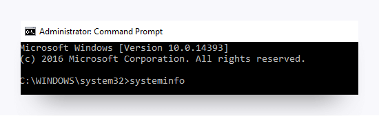
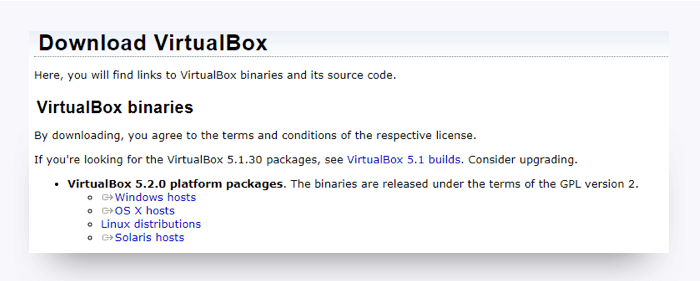
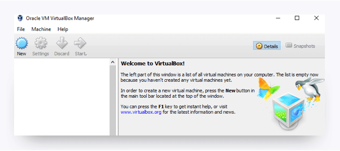

# Get Your Tools Installed (Windows)

You will be installing the required tools and software for the course. There's a lot to get through, so buckle in and get ready! 

## Computer Specifications

The computer you will use in this course needs to meet the following requirements. 

- Laptop with at least 8 GB RAM and 64-bit dual processor 

  **Note:** Desktops, netbooks, thin clients, and tablets are not permitted.

- Windows 7 or 10 operating system

- 100 GB free disk space \(300 GB preferred\)

- At least 2.0 GHz CPU

- Virtualization capable \(Check BIOS settings.\)

- USB port

- Full administrator \("root"\) privileges to operating and all software

### Additional Considerations

* If you are using a work-issued computer,  you may lack the permission to modify the system to successfully complete activities.
* Systems should have antivirus and antimalware installed. It is highly recommended that the computer be scanned for these issues and any findings remediated before attending class.
* A mouse is optional, but students may find it to be useful in completing labs efficiently.
* Students with limited free disk space may elect to purchase a external hard drive to store software and courseware. This is not a substitute for the required 100 GB of free disk space.

**Note:** If you need assistance determining these specifications, see the images below. 

### Check CPU and RAM

1. Right-click on the bottom task bar and select **Task Manager** to open.  

   **Note**: If you have trouble with this step, open the Start menu and type **task manager**. The icon will appear to the right.

2. Click on the **Performance** tab to view your machine's CPU statistics. Check the maximum speed and virtualization to make sure they meet the course requirements listed above. 

   The image below shows an Intel I7 CPU with 2.6 GHz speed and virtualization enabled. This one happens to be be a quad core, as shown on the bottom right. Generally the more cores the faster the computer.

Click **Memory** on the left panel of the screen to view RAM statistics. As shown in the image below, this laptop meets specifications with 16 GB and about 8 GB currently in use. 

**Note:** If your computer is at 8 GB RAM and operating near full capacity at times, you may want to investigate the software that is using excessive resources.

### Check Available Free Space

In File Explorer select **This PC**. You can also type **This PC** into the Start menu. Refer to the image below, which shows ample space available on the hard drives.

**Note:** Your laptop may have only the C: drive, which is fine as long as it has the required available space.

Note that most of the informatiom above can be obtained by running the `systeminfo` command from the terminal. Launch a terminal by right-clicking the Start icon and selecting **Command Prompt**. Enter the command shown in the box below. After several seconds the results will be output.

## Set Up Your Accounts

Let’s set up the accounts you'll be using in this course. 

- LinkedIn
- GitHub
- GitLab
- Google 
- Microsoft
- Cisco
- SANS
- ISACA
- ISC2

In addition, be sure to accept the invite for your section on Slack. You will receive the link to your class-specific channel during orientation.

### LinkedIn

1. Go to [LinkedIn](https://linkedin.com) and complete the registration process.
2. Create your profile. As recruiters often scour this site for job candidates, the minimum information on your profile should be a headshot photo, job history, education history, and relevant skills.
3. Start connecting with coworkers and friends! Build your network one connection at a time.

Looking for tips for creating an outstanding LinkedIn profile? Check out the links below.

- [22 Useful & Quick Ways You Can Improve Your LinkedIn Profile](https://www.searchenginejournal.com/improve-your-linkedin-profile/226433/)
- [How to Create an All-Star LinkedIn Profile ](http://topdogsocialmedia.com/linkedin-marketing-infographic/)

### GitHub

GitHub is a platform for coding and version control (managing frequently changing documents). Note that GitHub is optional for the class, but if you choose to create an account, you will use those same credentials for GitLab, which is required. 

Go to [GitHub](https://github.com) and complete the sign-up process.  We recommend including a headshot and contact information on your profile. 

### GitLab

GitLab is a similar platform to GitHub. We will be using Gitlab to store and retrieve course files. A separate account is not needed to access GitLab; you can you the GitHub account that was previously created. You will receive the link to your class-specific repository during orientation.

1. Go to [GitLab](https://gitlab.com/users/sign_in).

2. Click the GitHub logo (white cat on the black background\) to sign in with GitHub. You will be guided through the login process and will need to authorize the use of your GitHub credentials.

When your account is authenticated, you will see a Welcome screen. We recommend updating your profile to include a headshot and your contact information. 

### Cisco

Cisco Systems is the market leader in network equipment and network education. We will be using Cisco's program Packet Tracer, available in their learning portal NetAcad. Packet Tracer is a powerful network simulation program that allows students to experiment with networks.

As a Mac user, you will install the program on a Windows 10 virtual machine (VirtualBox), which we will walk you through below. 

1. Go to the [Packet Tracer](https://www.netacad.com/courses/packet-tracer-download/) download page.
2. Click **Enroll to download Packet Tracer**.
3. Enroll in the Introduction to Packet Tracer course by clicking **Sign up today!**
4. Complete the registration form.

**To be completed when VirtualBox is installed:**

1. Launch the Introduction to Packet Tracer course.
2. Scroll down and select the Windows installation file. 

### SANS

The SANS Institute is one of the world's leading cybersecurity training and knowledge-sharing communities. SANS stands for SysAdmin, Audit, Network, and Security. While their content is robust and heavily vetted, courses are priced at about 5,000 to 6,000 dollars for a one-week course. In this course we will use some of the members' public research and reports. 

Go to the [SANS](https://www.sans.org/account/create) sign-up page and complete the registration form.

Feel free to explore the [SANS](https://www.sans.org/) website. We suggest taking a look at their [GIAC certification pathways](https://www.giac.org/certifications/categories), [posters](https://www.sans.org/security-resources/posters/), and [reading room](https://www.sans.org/reading-room/). 

### ISACA

ISACA stands for Information Systems Audit and Control Association. ISACA's focus has traditionally been auditing, but the organization has always had a deep security side. ISACA also offers certifications, mainly in cyber leadership, risk management, and auditing. In this class we will reference material made available in the ISACA e-Library.

Go to the [Create Account](https://www.isaca.org/ecommerce/Pages/Create-Account.aspx) page on the ISACA website and complete the all four pages of the form. If you get an error message, check your email; your request may still have been processed. 

To learn more about ISACA, go [here](https://www.isaca.org/pages/default.aspx). 

### ISC2

ISC2 stands for International Information System Security Certification Consortium. This professional organization administers advanced cybersecurity certifications. You will need to create an account in order to take the certification exam as well as gain access to help documents and industry reports.

To create an account, go to the [(ISC2](https://www.isc2.org/) website and click **Sign in** on the top right of the screen. Then click **Create an Account** and fill in the required information. 

## Tool and Software Installations 

Follow the instructions below to complete the installation process for all of the required tools. We will be installing the following: 

- Google Chrome
- Slack
- Git and Git Bash
- SSH keys
- Python (Version 3)
- VS Code
- VirtualBox
- Kali Linux
- Ubuntu Linux
- GitKraken
- Wireshark

### Google Chrome

1. If you don’t already have Chrome installed, visit the download page [here](https://www.google.com/chrome/browser/desktop/index.html).

2. Download, open, and run the installation file.

While you're at it, you should go ahead and create a Google account, iif you don't have one already, by following these steps. 

1. Go to the [sign-up page](https://accounts.google.com/SignUp?) and complete the form. 

2. Review and accept Google's Privacy Policy. 

3. Verify you are logged in by browsing to google.com and looking for a personalized icon in the top right corner, as seen in the image below:

4. Click the grid icon to reveal the menu of Google services available to you, including Google Drive.

### Slack

**Note:** You will receive the link to your class-specific channel during orientation.

1. Search for Slack in Microsoft Store, and then click **Get the app.**

2. Click  **Join Now**.

3. Enter your full name and optional display name, and then create a password. Click **Next**.

4. Click your workspace name in the top left to open the menu.

5. Select **Sign in to another workspace**.

6. Enter your team’s Slack domain that you received during orientation and click **Continue**.

7. Enter your email address \(the one we used to invite you\) and password to sign in.

If you already have Slack installed, you just need to add your team to the application by following these steps:

1. Click your workspace name in the top left to open the menu.

2. Select **Sign in to another workspace**.

3. Enter your team’s Slack domain that you receive during orientation and click **Continue**.

4. Enter your email address \(the one we used to invite you\) and password to sign in.

### Git and Git Bash

1. Go to the Git [Downloads](https://git-scm.com/downloads) page. Select the download for Windows.

2. Run the installation file. Be sure to check off the correct boxes, as shown in the following four images.

3. Save Git to the desktop. This should save Git Bash to your desktop as well.

4. Select **Use Git from the Windows Command Prompt**.

5. Select **Checkout as-is, commit Unix-style line endings**.

6. Select **Use Windows' default console window**.

### SSH Keys

1. Open Bash.

2. To make sure you don’t already have a set of keys on your computer, type the following in your Bash window. **Note:** Copying and pasting will not work!

   ​								`ls –al ~/.ssh`

   - If no keys pop up, move on to Step 3.
   - If keys do pop up, check that none of them are listed under `id_rsa`, like in this image:

   

- If you find a key with a matching name, you can either overwrite it by following the next steps, or you can use the same key in Steps 8 and beyond. Be advised that you'll have to remember the password tied to your key if you decide not to overwrite it.

3. Type in the following command along with your email to generate your keys:

   `				ssh-keygen –t rsa –b 4096 –C "YOURGITHUBEMAIL@PLACEHOLDER.NET"`

4. When prompted to enter a file to save the key, press **Enter**. Then enter a passphrase for your key. **Note:** You shouldn’t see any characters appear in the window while typing the password. When you’re finished, your window should look like this:

5. Link your key to your machine using a tool called the ssh-agent. Run the following command in Bash to test whether the ssh-agent is running on your machine:​ `eval "$(ssh-agent –s)"`. Your Bash window should look like this:

   

6. Run the following command:​	`ssh-add ~/.ssh/id_rsa`.

7. Enter the passphrase associated with the key. **Note:** If you've forgotten the key, go back to Step 3 to create a new one. 

8. To add the key to GitHub, first copy the key to your clipboard by entering the following command:

   ​						`=pbcopy < ~/.ssh/id_rsa.pub`

   - You shouldn’t see any kind of message when you run this command. If you do, make sure you entered it correctly. 
   - Do not copy anything else to your clipboard until all steps are completed. Otherwise, you’ll have to enter the copy command again.

9. Go to GitHub's [SSH key settings](https://github.com/settings/ssh). Click **New SSH key**.

   

10. When the form pops up, enter a name for your computer in the Title input. In the Key input, paste the SSH key you copied in Step 8.

   

11. To add GitHub to your computer’s list of acceptable SSH hosts, type the following command in your Bash window:  `ssh –T git@github.com`. You should see an RSA fingerprint in your window. Enter “yes” only if it matches the one highlighted in the image below: 

    

### Python (Version 3)

For this course, you will need version 3.x.x of Python. Windows users will need to install Python.

Check to see if you have Python installed by following these steps:

1. Open a Git Bash window and enter the following command: `python --version`.

- If `Python 3.x.x` is returned, you have the correct version installed. 
- If `Python 2.x.x` is returned, you need to install the latest version of Python.
- If you get an error message that Python doesn't exist or something similar, you need to install the latest version of Python. 

To install Python version 3.x, follow these steps:

1. Go to the [Python](https://www.python.org/downloads/) website and download the latest version. Be sure to select the correct operating system. 
2. Follow the default installation steps. **Note:** Windows users must select the **Add Python 3.x to PATH** option from the Install Python dialog. 

Check that you have the latest version of Python installed again by opening Git Bash and entering the `python --version` command. 

### VS Code

1. Go to the [VS Code](https://code.visualstudio.com/) website to download and install the latest version.
2. When the installation is complete, open VS Code and click the extensions icon in the Activity bar. 
3. In the search bar, type **Python** and download the first extension that appears.

### VirtualBox

1. Go to the [Virtual Box download page](https://www.virtualbox.org/wiki/Downloads).

2. Select the download for Windows from the platform packages list. 
3. When the download is complete, go to your Downloads folder and click the VirtualBox file (.exe or .dmg) to initiate the installation. 
4. Follow the default installation steps. You may get a warning that you will be temporarily disconnected from the network. 
5. When the installation is complete, launch the application. If you see this screen, the installation was successful.

### Kali Linux

For this course we will download Kali Linux VirtualBox Images, which will allow us to skip the initial installation phase. (Think of this as cloning another system that is fully set up.)  Follow these steps to complete the download process. 

1. Go to  [Kali Linux Downloads—Virtual Images](https://www.offensive-security.com/kali-linux-vmware-virtualbox-image-download/).
2. Scroll down until you see the table of download options (see the screenshot below), and click the **Kali Linux VirtualBox Images** tab. 

3. Click **Kali Linux 64 bit Vbox** to download the file and complete the installation. 

### Ubuntu Linux

1. Go to [Download Ubuntu Desktop](https://www.ubuntu.com/download/desktop).

2. Click the **Download** button. If the download doesn't begin automatically, click **download now** on the next screen. 

   **Note:** You will be asked if you would like to donate to Ubuntu development. You can ignore this option. 

### GitKraken

1. Go to [GitKraken](https://www.gitkraken.com/).

2. Click the **Download Free Now** button. Confirm that is the correct download for your operating system; if necessary, select the correct version by clicking **See All Platforms**.

3. Locate the installation file on your computer once the download is complete. Drag the icon into your Applications folder, and then click on the icon to run the program.  

4. Log in with your GitHub credentials when prompted.

### Wireshark

1. Go to the [Download Wireshark](https://www.wireshark.org/download.html) page.

2. Select **Windows Installer \(64-bit\).**

3. Double-click on the executable file that will appear in the bottom left of your browser.

4. Select **Yes** on the User Account Control window. 

5. Click **Next** on the Setup window.

6. Select **I Agree** on the License Agreement window.

7. Click **Next** on the Choose Components window. The default settings are recommended for most users.

8. Click **Next** on the Select Additional Tasks window. The default settings are recommended for most users.

9. Click **Next** on the Choose Intall Location window. The default settings are recommended for most users.

10. Click **Next** on the Install WinPcap window. The default settings are recommended for most users.

11. Click **Install** on the Install USBPcap window.

12. When the installation is complete, click **Next** on the Welcome window. 

13. Select **I Agree** on the License Agreement for WinPcap window.

14. Click **Install** on the Installation Options window. The default setting is recommended for most users. 

15. Click **Finish.**

16. Click **Next** on the Installation Complete window. 

17. Click **Finish**, leaving the boxes unchecked. 

## You're Done! 

That's all for the installations, so give yourself a pat on the back! Installations are never fun, but just like taxes, you gotta do them.

Be sure to take a break before continuing with the rest of the prework.