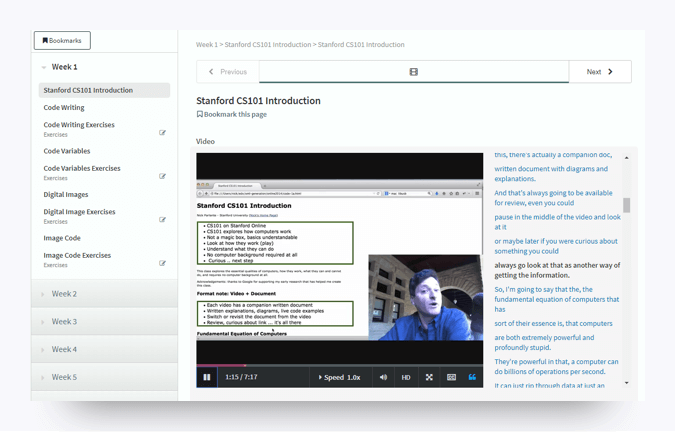
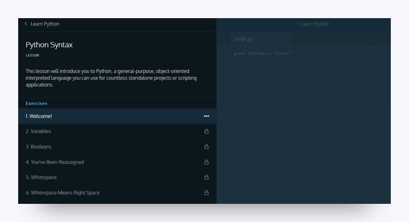
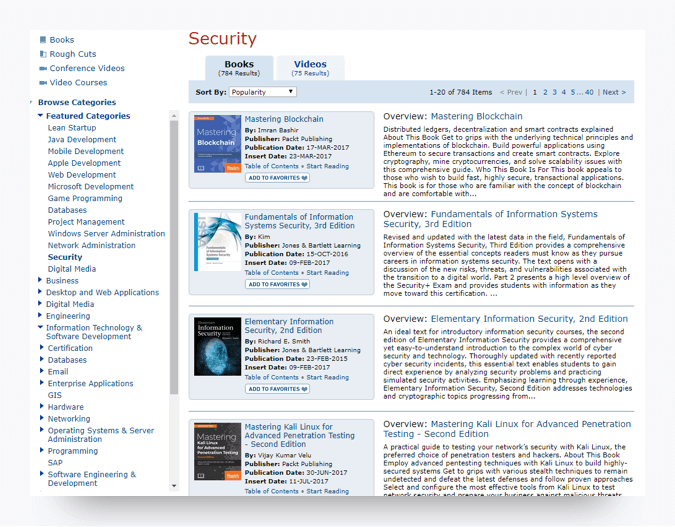

# Module 2: What to Expect in the Early Lessons & Reccomended Prep Activities 

Now that you have all the tools, you'll be able to hit the ground running on the first day of class. You may be curious about what the first few weeks of class will cover and if there is anything you can do to get ready beforehand. 

We will cover a lot of ground at the begining of course. Everything from largre-scale overviews of the cybersecurity domains and job markets to hands-on skills like working in the terminal and coding with python to fundamental concepts like networking and operating systems. Maybe that sounds daunting to you. Maybe you're familiar with a few of those skills, but you could use a refresher... Either way, have no fear! You will have plenty of opportunities to learn and practice once class starts. But you can also start right now, with some introductory prep activities.

Below is a list of recommended courses, readings, and writing activities focused on developing your skills as a cybersecurity professional.  We strongly encourage you to complete them at some point during the course. 

## SANS Cyber Aces

[SANS Cyber Aces](http://www.cyberaces.org/) is an online course that teaches the core concepts related to operating systems, networking, and systems administration. The course, developed by SANS, is self-paced through video lectures. The best part, it's **free**!

There are several hours of material available. You can see the full library [here](https://tutorials.cyberaces.org/tutorials). 
If you want to check out some of the topics we'll cover in class, then we reccomend prioritizing these three lessons: 

- [Linux—OS Background & Building the Linux VM](https://tutorials.cyberaces.org/tutorials/view/1-1-2)
- [Networking—Introduction and Layer 1](https://tutorials.cyberaces.org/tutorials/view/2-1)
- [Windows—Command Line Basics](https://tutorials.cyberaces.org/tutorials/view/1-2-3)

Note that these courses are designed with the assumption that you have solid IT fundamentals. 

## **Stanford Computer Science 101**

Don't have any prior technology background? Then we reccomend you check out the [free online  Computer Science 101 courses](https://online.stanford.edu/courses/soe-ycscs101-sp-computer-science-101) offered by Stanford University's School of Engineering. CS101 aims to provide general background on computers, demystify how they operate, and make them more accessible to a novice audience. 

To enroll in the course, you will need to register for a Stanford Online account as well as agree to Stanford University's academic policies and code of conduct. The course includes exercises and can be completed in about four hours.

## **Codeacademy: Python Tutorial**

Do you have any experience coding? We will start coding in the first few weeks of course. If you don't have any prior experience or need a refresher, check out [Codecademy](https://www.codecademy.com/), particularly the tutorial on [Python](https://www.codecademy.com/learn/learn-python). Python is a programming language that is often used due to its versatility and overall user-friendliness. 

The Python tutorial will get you acquainted with coding and set you up for the material coming down the pipeline in this course. Note that you must create a Codeacademy account before you can sign up for one of their courses. 

## **Recommended Writing**

Newcomers to the cybersecurity field are often surprised by the amount of writing that is required . If you are a good writer or simply enjoy writing, your future employer is going to love you. But if your writing skills could use some work, fear not! There are many helpful resources available, including the video series [Professional Writing Skills](https://www.youtube.com/playlist?list=PLzLHunnjEdX-YLYtSFgTfVJovtc8I4prp).

We will be doing plenty of writing in this program, including a report that you can later use as a writing sample for employers. You should use Google Docs for writing assignments. 

## **Safari Books**

Lastly, we recommend [Safari Books](https://www.safaribooksonline.com/) for cybersecurity articles and information. Unlike the previously mentioned resources, Safari Books comes with a price tag of $400 or $39 a month. If it is fiscally reasonable for you, it is well worth the investment. Safari Books is an amazing resource for thousands of technical books and video tutorials, including important Certification Prep texts that we will cover in the next module. 

**Note:** Veterans and current military may be eligible to obtain free access. Contact the learning resource center of your unit or base for more information. 

-------

### Copyright

Trilogy Education Services © 2018. All Rights Reserved.
