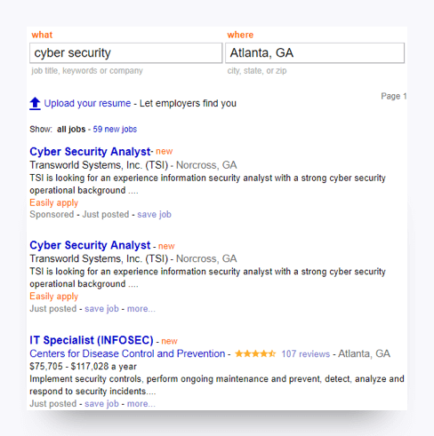
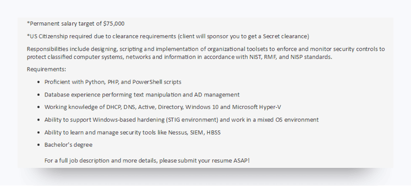

# Module 3: Understand the Job Market

Another central topic covered in the early stages of this course is the Cybersecurity job market. As you  will learn, it is a vast and layered landscape. We reccomend you familiarize yourself with the types of jobs currently in demand and keep in mind the required skills, experience and certifications that arise in your research. 

## 1. Explore Indeed.com

There are many job aggregating websites on the internet. One job board we reccomend using is [Indeed.com](www.indeed.com). The following activity is designed for you to aquaint yourself with the job search process. 

### Instructions

1. Enter **cyber security** (two words) in the **what** field. Set your location in the **where** field. Hit **return** or **Enter** (depending on your keyboard) to initiate the search. 

   Note: If you do not live in a metropolitan area, we recommend increasing the search radius in the left menu. 

2. Repeat the search with the following terms in the **what** box: 

   - cybersecurity (one word)
   - cyber
   - IT security
   - information 
   - INFOSEC
   - information assurance

3. Complete the following tasks:

   - Find a job post that interests you. Copy and paste the job description into a document and save it to a local folder.
   - Identify 10 terms that recur across multiple posts. Research each term, and then define it in your own words (one to three sentences per term). 

### Take-Aways: 

- Job titles for security professionals vary from organization to organization. Pay attention to the variety of job titles and adjust your search criteria as necessary so that you don't miss out on job postings.

- You may notice titles like *analyst, engineer, architect,* and *specialist.* We will discuss the hierarchy of these roles in class.

### Resources:

Check out the following infographics and articles to find out who is hiring and what they're looking for in candidates. 

- [State of Cyber Security 2017: Workforce Trends and Challenges](https://www.isaca.org/cyber/Documents/State-of-Cybersecurity-infographic_res_eng_0217.pdf)
- [State of Cyber Security 2017: Resources and Threats](http://www.isaca.org/cyber/Documents/State-of-Cybersecurity-part-2-infographic_res_eng_0517.pdf)
- [State of Cyber Security 2017: Part 2: Current Trends in the Threat Landscape](http://www.isaca.org/Knowledge-Center/Research/Documents/state-of-cybersecurity-2017-part-2_res_eng_0517.PDF)
- [The State of Cyber Security: 2016](http://www.isaca.org/cyber/Documents/State-of-Cybersecuritynew-infographic.pdf)
- [State of Cybersecurity: Implications for 2016](http://www.isaca.org/cyber/Documents/state-of-cybersecurity_res_eng_0316.pdf)
- [How to Get a Cybersecurity Job in Three Charts: a Degree, a Certification, and a Clearance](http://burning-glass.com/how-to-get-a-cybersecurity-job-in-three-charts-a-degree-a-certification-and-a-clearance/)
- [Cybersecurity Supply/Demand Heat Map](http://cyberseek.org/heatmap.html)

## **2. COMPTIA Activity**

This activity is designed to introduce you to the world of information technology certifications.  A certification is a testament to your skills and proficiency in a certain subject area or technology. Holding certifications has been shown to increase a job seeker's marketability to employers as well as result in a higher salary when hired. Certifications can also help you further your professional development. There are a variety of certifications available. Obtaining a certification almost always involves passing an exam.

To explore various certification pathways and general landscape, we will be using a resource developed by CompTIA, a certification body and professional organization. Here's what you need to do: 

1. Go to the [IT Certification Roadmap](https://certification.comptia.org/docs/default-source/downloadablefiles/it-certification-roadmap.pdf). 
2. Review the diagram, making note of CompTIA Network+, CompTIA Security+, CEH, and CISSP. These are the certifications that this cybersecurity boot camp was developed around. (This boot camp was influenced by other certifications in this diagram as well.) 

3. Download and save the following files to your computer. These will allow you to explore key certifications in depth to familiarize yourself with the content that lies ahead. They also serve as useful guides for the certification exams. You will notice that these certifications overlap significantly.
- [Network+](https://certification.comptia.org/docs/default-source/exam-objectives/comptia-network-%28n10-006%29_examobjectives.pdf)
- [Security+](https://certification.comptia.org/docs/default-source/exam-objectives/comptia-security-sy0-501-exam-objectives.pdf?sfvrsn=2)
- [Ethical Hacking \(CEH\)](https://www.eccouncil.org/wp-content/uploads/2016/02/cehv9-brochure.pdf)
- [Cybersecurity Leadership \(CISSP\)](https://www.isc2.org/-/media/ISC2/Certifications/Exam-Outlines/CISSP-Exam-Outline-121417--Final.ashx)

4. For each document, do the following: 
- Review the exam objectives you downloaded.
- In a Google Doc, make a list of topics with which you are already familiar, and save it in Google Drive.
- Submit this list using the instructions found in Module 1. 

## **3. Certification Prep**

The following texts will help prepapre you for the eventual certification testing. We recommend the following cybersecurity books, which may be available in digital formats as well as print. You may elect to purchase these after the course start date.

1. *CompTIA® Network+ N10–006 Cert Guide* by Keith Barker and Kevin Wallace
2. *CompTIA Security+ Certification Study Guide, Third Edition \(Exam SY0-501\)* by Glen E. Clarke
3. *CEH v9* B by Sean-Philip Oriyano
4. *CISSP \(ISC\)2 Certified Information Systems Security Professional Official Study Guide, Seventh Edition* by James M. Stewart, Mike Chapple, and Darril Gibson

-------

### Copyright

Trilogy Education Services © 2019. All Rights Reserved.
